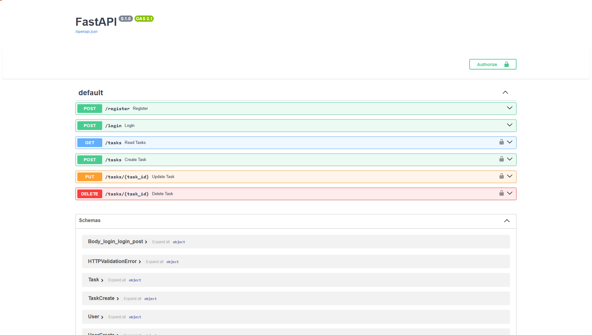

<p align="center">
  
</p>

# 📝 FastAPI Task Tracker

Простой REST API для управления задачами, реализованный с помощью FastAPI и SQLAlchemy.

---

## 📌 Описание

Проект представляет собой backend-сервис для выполнения базовых операций с задачами:

- ✅ Регистрация и аутентификация пользователей (JWT)
- 🆕 Создание задач
- 📋 Просмотр задач
- ✏️ Обновление задач
- ❌ Удаление задач

---

## 🚀 Технологии

- **Python 3.9+**
- **FastAPI** — быстрый асинхронный веб-фреймворк
- **SQLAlchemy** — ORM для взаимодействия с SQLite
- **JWT (JSON Web Tokens)** — авторизация и защита эндпоинтов
- **Pydantic** — валидация данных
- **Uvicorn** — ASGI-сервер для запуска

---

## ⚙️ Установка и запуск

1. **Клонировать репозиторий:**

```bash
git clone https://github.com/NikoVlasov/fastapi-tasks.git
cd fastapi-tasks
2. Создать и активировать виртуальное окружение:
Windows:
python -m venv .venv
.venv\Scripts\activate
Linux/macOS:
python3 -m venv .venv
source .venv/bin/activate
3. Установить зависимости:
pip install -r requirements.txt
4. Запустить приложение:
uvicorn main:app --reload

🔗 Документация
Swagger UI: http://127.0.0.1:8000/docs

Redoc: http://127.0.0.1:8000/redoc

🔐 Аутентификация
Авторизация осуществляется через JWT-токены. Все операции с задачами требуют заголовка:
Authorization: Bearer <your_token>

📮 Эндпоинты
✅ Регистрация
POST /register
Тело запроса:
{
  "username": "your_username",
  "password": "your_password"
}

🔓 Вход
POST /login
Форма запроса (x-www-form-urlencoded):
username=your_username&password=your_password
Ответ:
{
  "access_token": "your_jwt_token",
  "token_type": "bearer"
}

📌 Создание задачи
POST /tasks
Заголовок: Authorization: Bearer <ваш_токен>

Тело запроса:{
  "title": "Новая задача",
  "description": "Описание",
  "done": false
}

📋 Получение всех задач
GET /tasks
Заголовок: Authorization: Bearer <ваш_токен>

✏️ Обновление задачи
PUT /tasks/{task_id}
Пример:
PUT /tasks/1?title=Новое+название&description=Новое+описание&done=true

❌ Удаление задачи
DELETE /tasks/{task_id}
📎 Лицензия
Проект распространяется под лицензией MIT.
📫 Контакты
GitHub: NikoVlasov

Email: snat140823061990@gmail.com
